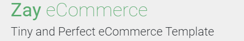

# Zay_Online_Shop_Layout_Example

- In this project, you will develop a responsive online shop interface by replicating a pre-designed layout. The design (Zay Online Shop Layout Example) provides the visual structure, and your job is to recreate it using HTML, CSS, depending on the level of interactivity needed.

## Table of Contents

- [Features](#features)
- [Technologies Used](#technologies-used)
- [Installation](#installation)
- [Usage](#usage)
- [Screenshots](#screenshots)
- [Contact](#contact)

## Features

- **Responsive Design**: Adapts to various screen sizes including 600px, 890px, 1200px, 1400px, and 1600px breakpoints.
- **Modern Layout**: Utilizes CSS Grid and Flexbox for layout and positioning.
- **Minimal Dependencies**: Only uses FontAwesome for icons and Google Fonts for typography.
- **Event Locations:** Find out where to see our cars in person, including exhibitions at Classic Remise Düsseldorf and Berlin.

## Technologies Used

- `HTML5`: For structuring the content on the website.
- `CSS3`: For styling and layout.
- `Font Awesome`: For icons used in the project.
- `Bunny Fonts`: For custom typography.

## Installation

To run this project locally, follow these steps:

1. Clone the repository:
   ```bash
   https://github.com/sandoropiok/online_shop_layout_example
   ```
2. **Navigate to the Project Directory:**
   ```bash
   cd online_shop_layout_example
   ```
3. **Open the `index.html` File:**
   - You can view the project by opening the index.html file in a web browser.

## Usage

The website is static and does not include JavaScript functionality. It is designed for display purposes and can be used as a template for building a more dynamic e-commerce site.

## Screenshots


## Contact

For any questions or feedback, feel free to reach out to me:

- GitHub: [GitHub-Profile](.https://github.com/sandoropiok)

## More Screenshots


